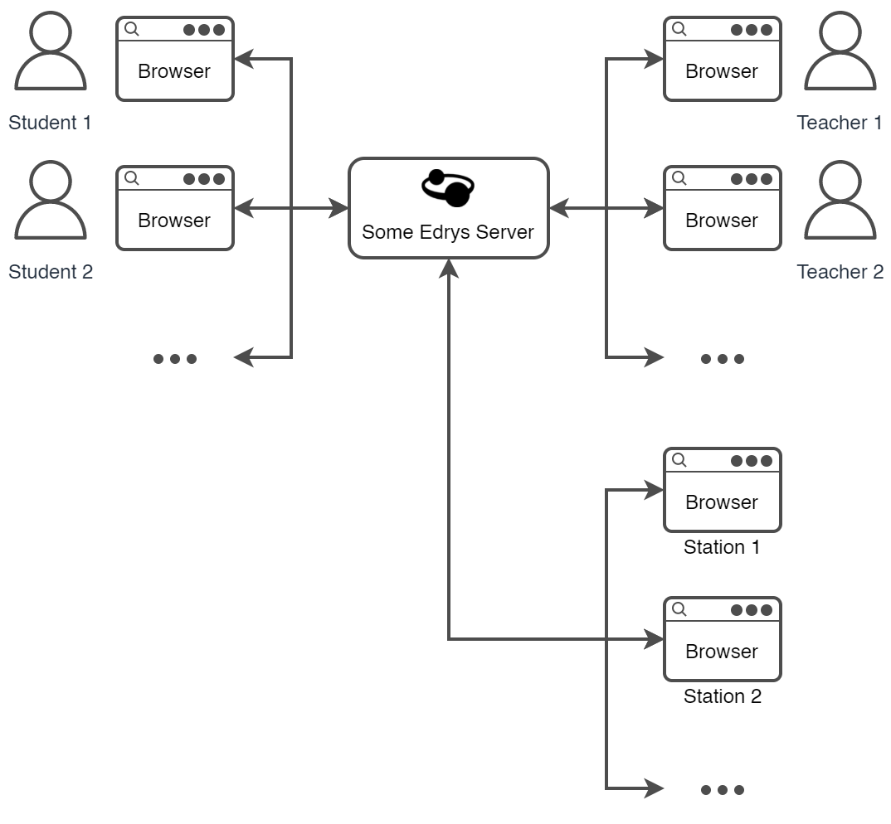

# Stations

Edrys Stations are a feature that allows building remote labs, automated
grading, and other experiences that require a non-human teacher at the other
end. 

A station is simply an Edrys class open in the browser in "station mode"
and left to respond to student queries. This functionality is handled by
the modules loaded on the station end. Stations can run on any machine 
with a browser on it (eg. a server, laptop, Raspberry Pi, or even an always-on old
smartphone).

To create a station, navigate to class settings and copy the special class 
station URL. You can now open this URL on any browser (you will have to log 
in with a teacher's account). When you navigate back to your class, you will
see a special room has been added, represeting that station. Click on the room 
to talk to the station, or drag students into the room to get them to use 
the station. When you close the station URL, that room will disappear on its own.

To make the concept clearer, here is what an Edrys class looks like with stations:

## Example Arduino Remote Lab

An example use case of stations is to create a remote Arduino Lab, where students can remotely interact with an Arduino (upload code to it and see the result through a camera) that is physically hosted somewhere else (eg. university grounds). In this example, a university would like to allow its students access to their fleet of lab devices remotely, removing any need for students to be physically present to experiement with the devices. 

To achieve this with Edrys, each Arduino would be connected to a computer with internet access (in this example a Raspberry Pi), and a station would be open on the each computer's browser. We can use a USB webcam with the [Video Chat](https://github.com/edrys-org/module-video-chat) module to let students see the Arduino, and the [Code Editor](https://github.com/edrys-org/module-code) module to allow students to upload code to it. The overall setup for one station could look like this:

Something to note in this setup is the presece of the Arduino Comms Agent (more info [here](https://github.com/edrys-org/module-code#usage)), which is a simple localhost server that allows modules in the browser to talk to the Arduino (since the browser can't natively do that, unlike with the webcam).

Overall, this allows easy set up of remote labs without configuring security, servers, port forwarding, or any other infrastructure. All that is needed is a browser running, which can be repeated for any number of stations. This produces a portable, scalable, and easy-to-share setup that can be replicated even by non-technical teachers. The same principles apply to any other lab devices (since modules can be reused, combined, or developed to accomodate any setup).

## Auto-Assign

A common use case when building remote labs or automated grading is the need for students to be automatically assigned to stations without human intervention (in this case, a teacher dragging students in and out of station rooms). The official [Auto-Assign Module](https://github.com/edrys-org/module-auto-assign) allows adding such functionality.

---

⬆️ Back to [contents](README.md)
